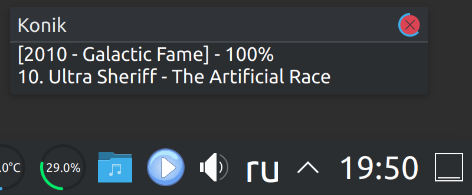
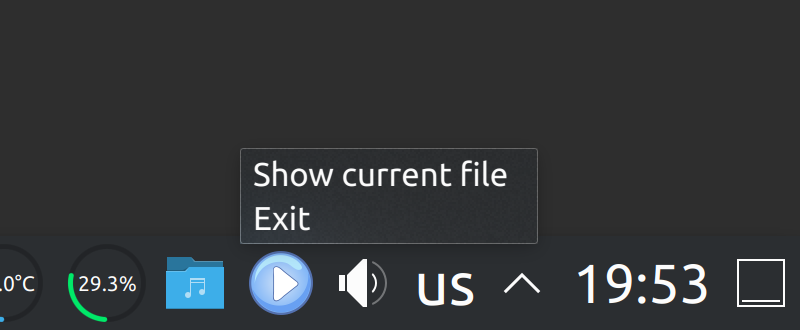

# Konik

Music player controlled by global hotkeys.

The player itself does not have any GUI except a tray icon and a context menu.

Currently only for Linux with X11 and ALSA.

## Screenshots

## Features

* Formats: FLAC, OGG, MP3
* CUE sheets (for FLAC)
* Gapless playback
* ListenBrainz/Last.fm scrobble (with offline support)
* System volume control
* MPRIS
* Show current file in the file manager

## CLI

`konik <path_1> <path_2> ...`

where `<path_N>` is a path to a music file or a folder.

* The folders are loaded recursively
* To load a CUE sheet you need to pass the entire folder as `path`
  (a folder must contain the CUE sheet and corresponding).

Run `konik help` or `konik readme` for more help.

## Hotkeys

* NumPad 5 - play/stop
* NumPad 0 - play/pause
* NumPad 4 - previous track
* NumPad 6 - next track
* NumPad 7 - previous folder
* NumPad 9 - next folder
* NumPad 2 - decrease volume
* NumPad 8 - increase volume
* NumPad 1 - decrease system volume
* NumPad 3 - increase system volume

The state of `NumLock` may or may not affect the hotkeys behavior.

Konik won't launch if any other program have exclusive access to any of these keys.

## ListenBrainz / Last.fm

* **ListenBrainz** - use `konik listenbrainz-auth` to authorize your ListenBrainz account.
  You need to enter your user token.
  You can get it at https://listenbrainz.org/profile/.

* **Last.fm** - use `konik lastfm-auth` to authorize your Last.fm account.
  You need to enter your login and password from the Last.fm website.
  These credentials are not stored by Konik.

The above commands will also warn you if you are already authorized
and what file needs to be removed to revoke the authorization.
Another way to revoke the access is to open the data folder with `konik data-folder`
and then remove `lastfm_session_key` and/or `listenbrainz_token` files.

The track will be sent as "currently playing" after 5 seconds of the playback.
The track will be scrobbled 5 seconds prior its end.
Only tracks longer than 30 seconds will be scrobbled.
The track will not be scrobbled if it was rewinded of fast-forwarded (via MPRIS).

## Tray context menu

Use tray context menu to perform some other actions.
Currently, these actions are supported:

* **Show current file** - open the default file manager and highlight the current file
* **Exit** - close Konik

## Build

Install the dependencies:

* development libraries for `dbus` and `alsa`
* `pkg-config`

On Ubuntu it will be `sudo apt install libdbus-1-dev libasound2-dev pkg-config`.

Run `build-unix.sh` to make a release build.

To build Konik with Last.fm support, create a file `lastfm.key` at the repository root.
On the first line put your API Key, on the second line put your Shared Secret.
More info on where to get these keys: https://www.last.fm/api.

## Third-party libraries and resources

Direct dependencies can be seen in [Cargo.toml](Cargo.toml).

Tray icons are based on an icon by Francesco 'Architetto' Rollandin:
https://openclipart.org/detail/33583

## License

[GPLv3](COPYING)
